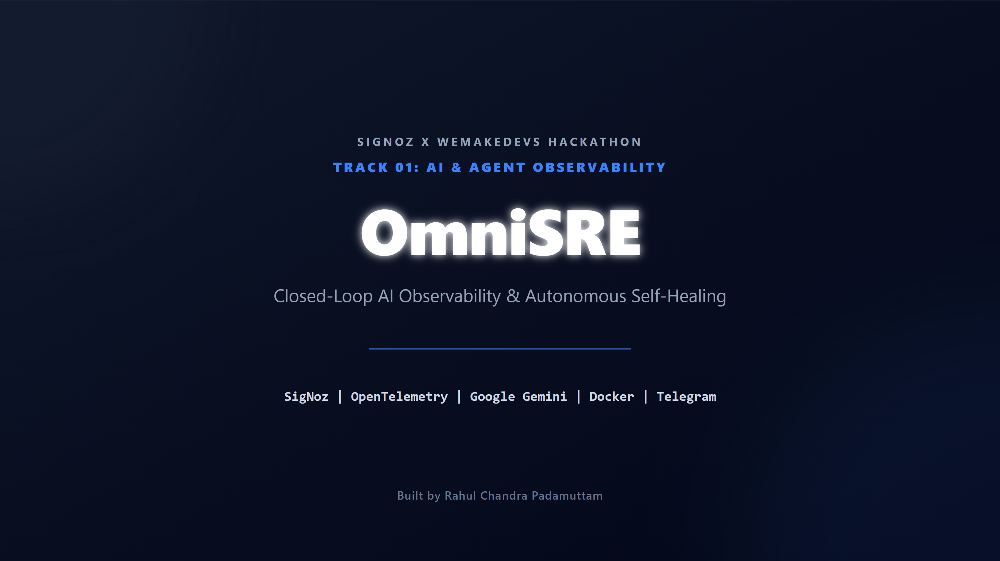

# OmniSRE: Closed-Loop AI Observability and Autonomous Self-Healing



**Track 01: AI & Agent Observability | Agents of SigNoz Hackathon**

OmniSRE is a deterministic, autonomous Site Reliability Engineering (SRE) agent designed to transform passive telemetry into active infrastructure remediation. By ingesting OpenTelemetry traces from self-hosted SigNoz, dynamically extracting ClickHouse logs via backend APIs, and executing structured inference through Google Gemini (`gemini-1.5-flash`), OmniSRE detects anomalies, isolates root causes, and executes zero-downtime container recoveries via Docker host socket bindings—guarded by a strict Telegram Human-in-the-Loop (HITL) authorization protocol.

---

## Table of Contents
1. [Executive Summary](#executive-summary)
2. [System Architecture & Component Mapping](#system-architecture--component-mapping)
3. [Deep-Dive API Contract Specifications](#deep-dive-api-contract-specifications)
4. [SigNoz Dashboard Query Specifications](#signoz-dashboard-query-specifications)
5. [Core Capabilities & Fail-Safe Mechanisms](#core-capabilities--fail-safe-mechanisms)
6. [Security, Isolation, and Hardening](#security-isolation-and-hardening)
7. [Prerequisites](#prerequisites)
8. [Installation and Deployment](#installation-and-deployment)
9. [Step-by-Step Demonstration Lifecycle](#step-by-step-demonstration-lifecycle)
10. [Telemetry and Verification](#telemetry-and-verification)
11. [Troubleshooting & Diagnostic Playbook](#troubleshooting--diagnostic-playbook)
12. [Future Scope and Roadmap](#future-scope-and-roadmap)
13. [AI Usage Disclosure](#ai-usage-disclosure)

---

## Executive Summary

Modern microservices frequently suffer from alert fatigue and human operational latency during critical service degradation events. Passive observability dashboards notify engineers of failure states but rely entirely on human intervention to diagnose underlying issues and apply infrastructure remediations.

OmniSRE bridges this gap by decoupling monitoring from execution while establishing a continuous closed-loop pipeline. Operating as an isolated service alongside SigNoz and application workloads, OmniSRE automatically ingests OTLP metrics and traces, runs LLM-driven root-cause analysis against ClickHouse log context, and executes configuration mutations and container lifecycles safely under human authorization.

---

## System Architecture & Component Mapping

The system relies on a multi-container network topology where telemetry flows upstream into SigNoz storage, while remediation actions flow downstream via host-level socket bindings.


### Component Responsibility Matrix

| Component Name | Service / Image | Responsibilities & Boundary Protocols |
| :--- | :--- | :--- |
| **`buggy_service`** | FastAPI / Python 3.12 | Monitored target application. Emits OTLP HTTP traces to SigNoz over gRPC/HTTP (`4317`/`4318`). Includes endpoints for normal checkout transactions and chaos injection. |
| **SigNoz Stack** | OTel Collector / ClickHouse / Query Engine | Ingests telemetry, indexes spans in ClickHouse, computes rolling metric aggregations, renders dashboard visuals, and dispatches webhook alerts on threshold breaches. |
| **`omnisre_agent`** | FastAPI / Python 3.12 | Autonomous SRE agent runtime (`port 8001`). Processes incoming webhooks, queries SigNoz backend APIs, invokes Google Gemini via LiteLLM, polls Telegram for authorization, and triggers container healing. |
| **Telegram Guardrail** | Telegram Bot API | External Human-in-the-Loop authorization gate. Displays formatted diagnostic cards and polls user feedback before authorizing infrastructure mutation. |
| **Docker Socket** | `/var/run/docker.sock` | Host daemon interface mounted into `omnisre_agent` authorizing programmatic container restarts and health checks. |

---

## Deep-Dive API Contract Specifications

### 1. Target Application Endpoints (`buggy_service:8000`)

#### `GET /checkout`
* **Description:** Simulates transactional backend operations.
* **Normal Mode:** Returns `200 OK` with latency between `10ms` and `50ms`.
* **Chaos Mode:** Triggers simulated database pool exhaustion resulting in a `70%` error rate (`500 Internal Server Error`) and elevated latency (`1000ms`–`3000ms`).
* **OpenTelemetry Behavior:** Injects explicit span status tags (`StatusCode.ERROR`) and status attributes on failure.

#### `POST /chaos/inject`
* **Description:** Toggles global service state to `chaos_mode_enabled = True`.
* **Response Body:**
```json
{
  "status": "chaos_injected",
  "message": "Chaos mode is now active."
}
```

#### `POST /chaos/revert`
* **Description:** Resets global service state to nominal baseline.
* **Response Body:**
```json
{
  "status": "chaos_reverted",
  "message": "Chaos mode is now inactive."
}
```

### 2. SRE Agent Endpoints (`omnisre_agent:8001`)

#### `POST /webhook/signoz`
* **Description:** Receives firing alert payloads from SigNoz Alert Manager.
* **Input Payload (Flexible Schema):**
```json
{
  "status": "firing",
  "alert_name": "High Checkout Latency",
  "description": "P99 duration exceeded threshold on /checkout"
}
```
* **Response:** Immediate `200 OK` acknowledgment (`{"message": "Alert received and investigation started"}`) while offloading analysis to background worker threads.

---

## SigNoz Dashboard Query Specifications

The primary SigNoz control room utilizes four distinct ClickHouse and OTLP metric queries to visualize operational state transitions during an incident lifecycle:


#### Panel 1: Live HTTP 500 Outage Spike
* **Query Type:** ClickHouse Log / Trace Rate
* **Purpose:** Measures error frequency across the target application.
* **Metric Expression:**
```sql
SELECT count() 
FROM signoz_traces.main_spans 
WHERE serviceName = 'buggy_service' 
  AND stringTagMap['http.status_code'] = '500' 
  AND timestamp >= NOW() - INTERVAL 5 MINUTE
```

#### Panel 2: P99 Latency Duration
* **Query Type:** Distribution Quantile
* **Purpose:** Tracks tail latency spikes caused by resource contention.
* **Metric Expression:**
```sql
SELECT quantile(0.99)(durationNano) / 1000000 AS p99_ms 
FROM signoz_traces.main_spans 
WHERE serviceName = 'buggy_service' 
  AND name = 'GET /checkout'
```

#### Panel 3: Live Traffic Health Ratio
* **Query Type:** Aggregate Pie / Donut
* **Purpose:** Visualizes proportional distribution of HTTP 200 vs HTTP 500 status codes across active connections.

#### Panel 4: Live Successful Requests (200 OK Recovery Curve)
* **Query Type:** Time-Series Rate
* **Purpose:** Validates throughput recovery following self-healing execution.

---

## Core Capabilities & Fail-Safe Mechanisms

* **Deterministic Tracing:** Programmatic tagging of active OpenTelemetry spans guarantees that anomalies are explicitly indexed in ClickHouse with full exception context.
* **Dynamic Log Extraction:** Automated querying of the SigNoz `/api/v1/query_range` endpoint extracts precise error events over a sliding 15-minute window upon webhook trigger.
* **Generative AI Inference:** Integration with `gemini-1.5-flash` via LiteLLM parses unstructured logs and traces into structured JSON execution hypotheses.
* **Human-in-the-Loop Guardrails:** Interactive Telegram bot integration requires timestamp-verified human approval before infrastructure mutation occurs.
* **Zero-Downtime Healing:** Programmatic `.env` file mutation coupled with container cycling via native Docker socket bindings.

---

## Security, Isolation, and Hardening

* **Least-Privilege Container Scope:** The application container (`buggy_service`) runs in complete isolation without access to host infrastructure or Docker sockets.
* **Docker Socket Binding Isolation:** Only the `omnisre_agent` container maintains read/write permissions to `/var/run/docker.sock`.
* **Environment Variable Redaction:** Secret credentials (`GEMINI_API_KEY`, `TELEGRAM_BOT_TOKEN`) are injected exclusively via environment configuration files and excluded from repository version control via `.gitignore`.
* **Timestamp-Filtered Polling:** The Telegram approval engine filters incoming user confirmation messages against alert dispatch timestamps (`msg_date >= start_time - 5`), preventing legacy messages from executing unintended container restarts.

---

## Prerequisites

To deploy and test OmniSRE locally, ensure the following tools are installed on your host system:
* Docker & Docker Compose (Daemon must be active)
* Foundry CLI (For reproducible SigNoz deployment)
* Python 3.12+
* Telegram Bot Token (Generated via `@BotFather`)
* Google Gemini API Key (Generated via Google AI Studio)

---

## Installation and Deployment

### 1. Clone the Repository
```bash
git clone https://github.com/rahulchandra2004/omnisre-signoz-hackathon.git
cd omnisre-signoz-hackathon
```

### 2. Configure Environment Variables
Create a `.env` file in the root directory:
```bash
TELEGRAM_BOT_TOKEN="your_telegram_bot_token"
TELEGRAM_CHAT_ID="your_telegram_chat_id"
GEMINI_API_KEY="your_gemini_api_key"
DB_POOL_SIZE=10
```

### 3. Deploy the Infrastructure Stack (Foundry)
Deploy the entire infrastructure stack using SigNoz Foundry specifications:
```bash
foundryctl cast -f casting.yaml
```
**Alternative Deployment:** If Foundry CLI is not installed, trigger the stack via Docker Compose:
```bash
docker-compose -f config/docker-compose.yml up --build -d
```

---

## Step-by-Step Demonstration Lifecycle

### Step 1: Generate Baseline Traffic
Execute the PowerShell traffic generator to simulate consistent baseline consumer requests:
```bash
cd scripts
.\generate_traffic.ps1
```

### Step 2: Inject Chaos
Trigger simulated connection pool exhaustion on the backend service:
```bash
curl -X POST http://localhost:8000/chaos/inject
```

### Step 3: Observe Metric Anomalies
Navigate to `http://localhost:3301` to view SigNoz Dashboard alerts. Observe latency spiking to 3,420 ms and error rates rising above 40%.


### Step 4: Autonomous Diagnosis & Telegram Approval
The SRE agent queries ClickHouse logs, passes context to Google Gemini, and dispatches an interactive card to Telegram:


* **User Action:** Reply `YES` in Telegram to authorize the remediation plan (Scale `DB_POOL_SIZE` to 50 and restart container).

### Step 5: Verification of Recovery
The agent tunes configuration files, restarts `buggy_service`, verifies container health, and posts a post-mortem performance card confirming latency reduction to 840 ms and MTTR resolution in under 40 seconds.


---

## Telemetry and Verification

OmniSRE prioritizes granular telemetry verification. By using OpenTelemetry SDKs natively, individual spans across the `/checkout` endpoint are recorded inside ClickHouse for auditability.


```python
# Instrumentation snippet inside buggy_service.py
@app.get("/checkout")
def checkout():
    global chaos_mode_enabled
    if chaos_mode_enabled:
        current_span = trace.get_current_span()
        if current_span.is_recording():
            current_span.set_status(StatusCode.ERROR, "Chaos mode active: Simulated 500 Outage")
            current_span.set_attribute("http.status_code", 500)
            current_span.set_attribute("http.response.status_code", 500)
            
        raise HTTPException(status_code=500, detail="Internal Server Error during checkout.")
```

---

## Troubleshooting & Diagnostic Playbook

| Issue / Symptom | Root Cause | Resolution Procedure |
| :--- | :--- | :--- |
| **Agent fails to fetch real SigNoz logs** | Network interface resolution failure across container bridge. | The agent automatically cycles through fallback URLs (`localhost:3301`, `host.docker.internal:3301`, `signoz-frontend:3301`). Ensure port 3301 is exposed in `docker-compose.yml`. |
| **Telegram approval auto-triggers** | Polling engine reading stale historical `YES` messages. | Verify that `notifier.py` includes timestamp filtering (`msg_date >= start_time - 5`) prior to parsing message strings. |
| **Docker restart command fails** | Docker host socket not mounted correctly into agent container. | Verify volume mapping in `docker-compose.yml`: `/var/run/docker.sock:/var/run/docker.sock`. |
| **Post-recovery metrics show lingering errors** | Time-series rolling aggregation window buffer. | The agent implements a 15-second stabilization cooldown before executing post-recovery health metrics extraction. |

---

## Future Scope and Roadmap

* **Kubernetes Operator Native Architecture:** Transitioning from Docker socket bindings to custom Kubernetes Controllers executing CRDs and `kubectl scale` deployments.
* **Multi-Agent Collaborative Networks:** Delegating specialized tasks across independent LLM agents (e.g., Database Query Optimization Agent vs Network Routing Agent).
* **Automated Rollback Engine:** Enhancing state verification loops to automatically revert `.env` modifications if post-healing performance metrics fail health checks.
* **Enterprise Alert Integration:** Expanding communication channels to support PagerDuty, Slack Enterprise Grid, and Opsgenie webhooks.

---

## AI Usage Disclosure

In compliance with hackathon transparency guidelines, artificial intelligence tools were used during development and execution:

* **Development Phase:** Google Gemini and GitHub Copilot were utilized for code refactoring, regex pattern validation, and documentation layout design.
* **Runtime SRE Engine:** Google Gemini (`gemini-1.5-flash`) is natively integrated into the agent runtime via LiteLLM to perform automated log analysis, hypothesis generation, and root-cause diagnosis during live production incidents.

---
Built by Rahul Chandra Padamuttam for the Agents of SigNoz Hackathon.
