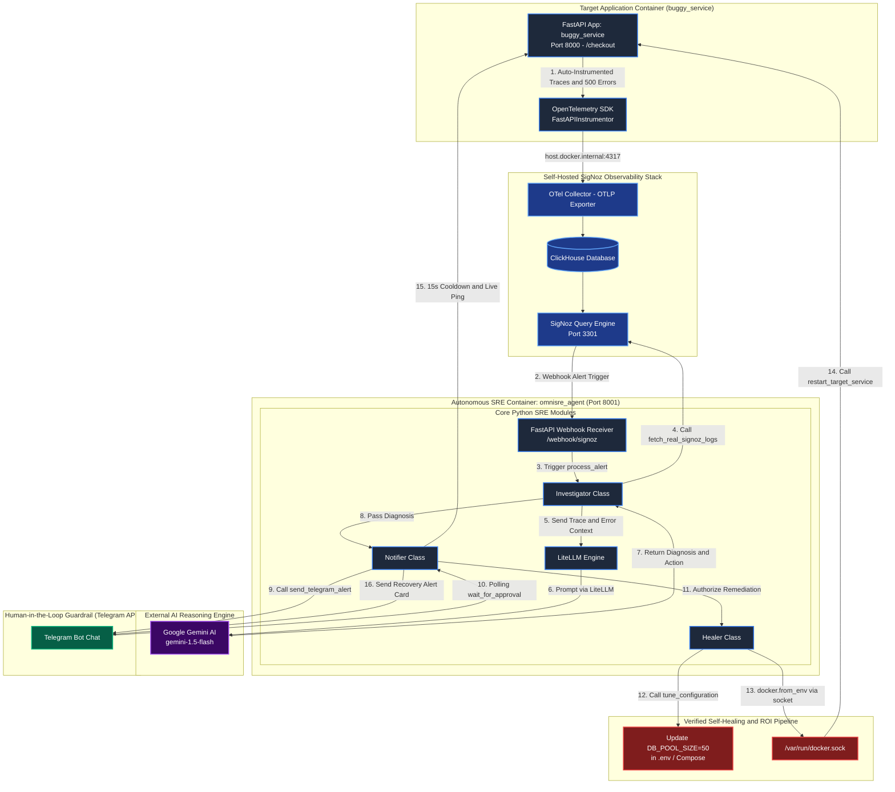
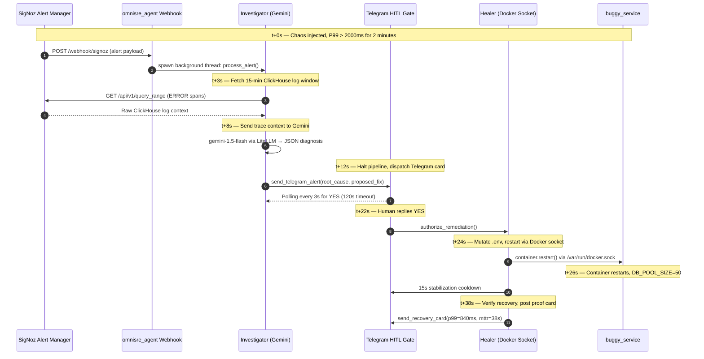

# OmniSRE: Autonomous AI SRE Agent with Closed-Loop Self-Healing

> Self-hosted SigNoz + OpenTelemetry + Google Gemini + Telegram HITL — an autonomous agent that detects incidents, diagnoses root causes, and restarts containers in **under 40 seconds**, without waking you up.


**Track 01: AI & Agent Observability | WeMakeDevs x Agents of SigNoz Hackathon**


**Watch the 3-Minute Live Demo:**

[](https://youtu.be/GMaUc4ksh6A)

---

## Results at a Glance

| Metric | During Chaos | After Self-Healing |
| :--- | :--- | :--- |
| P99 Latency | 3,420 ms | **840 ms** |
| HTTP 500 Rate | > 40% | **0%** |
| HTTP 200 Rate | < 60% | **100%** |
| MTTR | 15–45 min (human) | **< 40 seconds** |

---

## What OmniSRE Does

1. **Deploys a self-hosted SigNoz stack** via Foundry CLI — one command, six containers, fully reproducible
2. **Auto-instruments a FastAPI service** with OpenTelemetry SDKs — traces and error spans flow into ClickHouse
3. **Receives SigNoz alert webhooks** — no polling, event-driven pipeline from detection to diagnosis
4. **Queries ClickHouse logs** over a 15-minute sliding window via `/api/v1/query_range`
5. **Sends trace context to Google Gemini** (`gemini-1.5-flash` via LiteLLM) — structured JSON root-cause output
6. **Dispatches a Telegram diagnostic card** — halts all action until you reply `YES`
7. **Mutates `.env` configuration and restarts the container** via `/var/run/docker.sock` — zero-downtime healing
8. **Posts a post-mortem report** — latency and error rate proof after recovery

---

## System Architecture



### Incident Response Sequence (with Timing)



---

## Repository Layout

```
.
├── agent/
│   ├── main.py             # FastAPI webhook receiver and pipeline orchestrator
│   ├── investigator.py     # SigNoz log fetcher + Gemini RCA engine
│   ├── notifier.py         # Telegram HITL dispatcher and approval poller
│   ├── healer.py           # .env mutator + Docker socket restart executor
│   └── requirements.txt
├── app/
│   ├── buggy_service.py    # Monitored FastAPI app with chaos injection endpoints
│   ├── Dockerfile
│   └── requirements.txt
├── assets/                 # Screenshots and demo images
├── config/
│   └── docker-compose.yml  # Service topology with Docker socket binding
├── scripts/
│   ├── generate_traffic.ps1  # PowerShell baseline traffic generator
│   └── trigger_chaos.ps1     # One-click chaos injection script
├── casting.yaml            # SigNoz Foundry deployment manifest
├── run_demo_gui.py         # Tkinter GUI for live hackathon demonstration
└── README.md
```

---

## Prerequisites

| Tool | Purpose | Install | Verify |
| :--- | :--- | :--- | :--- |
| Docker & Docker Compose | Container runtime and service topology | [docs.docker.com](https://docs.docker.com/get-docker/) | `docker --version` |
| Foundry CLI | One-command SigNoz deployment | `curl -fsSL https://signoz.io/foundry.sh \| bash` | `foundryctl --version` |
| Python 3.12+ | Agent and application runtime | [python.org](https://www.python.org/downloads/) | `python --version` |
| Telegram Bot Token | HITL authorization channel | Create via [@BotFather](https://t.me/BotFather) | Send `/start` to your bot |
| Google Gemini API Key | LLM root-cause inference | [aistudio.google.com](https://aistudio.google.com/apikey) | Check quota dashboard |

---

## Quick Start

### 1. Clone the Repository
```bash
git clone https://github.com/rahulchandra2004/omnisre-signoz-hackathon.git
cd omnisre-signoz-hackathon
```

### 2. Configure Environment Variables

Create a `.env` file in the project root:

| Variable | Required | Description | Example |
| :--- | :--- | :--- | :--- |
| `TELEGRAM_BOT_TOKEN` | ✅ | Token from [@BotFather](https://t.me/BotFather) | `123456:ABC-xyz...` |
| `TELEGRAM_CHAT_ID` | ✅ | Your Telegram user or group ID | `987654321` |
| `GEMINI_API_KEY` | ✅ | Google AI Studio key for Gemini inference | `AIzaSy...` |
| `DB_POOL_SIZE` | ✅ | Initial connection pool size (agent scales this to 50) | `10` |

```bash
TELEGRAM_BOT_TOKEN="your_telegram_bot_token"
TELEGRAM_CHAT_ID="your_telegram_chat_id"
GEMINI_API_KEY="your_gemini_api_key"
DB_POOL_SIZE=10
```

### 3. Deploy the SigNoz Observability Stack

> **Why self-hosted SigNoz?** OmniSRE requires direct access to the ClickHouse backend via `/api/v1/query_range` to programmatically extract raw error spans. Managed cloud observability platforms do not expose this API. Self-hosting also eliminates data egress costs and gives the agent full query control with zero rate limiting.

```bash
export PATH="$HOME/.local/bin:$PATH"
foundryctl cast -f casting.yaml
```
> **Alternative:** `docker-compose -f config/docker-compose.yml up --build -d`

SigNoz UI will be available at `http://localhost:3301` within ~3 minutes.

### 4. Run the Demo
```bash
# Generate baseline traffic
cd scripts && .\generate_traffic.ps1

# Inject chaos (database pool exhaustion)
curl -X POST http://localhost:8000/chaos/inject
```

Watch your **Telegram** receive the diagnostic card. Reply `YES` and the agent heals the service automatically.

---

## Demo Lifecycle

### Step 1: Inject Chaos → SigNoz Alerts Fire

```bash
curl -X POST http://localhost:8000/chaos/inject
```

Navigate to `http://localhost:3301` — P99 latency spikes to **3,420 ms**, error rate exceeds **40%**.


### Step 2: Gemini Diagnoses → Telegram Dispatches

The agent fetches 15 minutes of ClickHouse logs, passes them to Gemini, and sends a structured diagnosis card to Telegram.


Reply `YES` to authorize the remediation.

### Step 3: Container Self-Heals → Recovery Confirmed

The agent scales `DB_POOL_SIZE` to 50, restarts `buggy_service` via Docker socket, waits 15 seconds, and posts a recovery proof card.


---

## API Reference

### Target Application (`buggy_service:8000`)

| Endpoint | Method | Description |
| :--- | :--- | :--- |
| `/checkout` | GET | Simulates transactions. Returns `200 OK` (normal) or `500` with 1000–3000ms latency (chaos mode) |
| `/chaos/inject` | POST | Enables chaos mode — triggers database pool exhaustion simulation |
| `/chaos/revert` | POST | Disables chaos mode — restores nominal baseline |

### SRE Agent (`omnisre_agent:8001`)

| Endpoint | Method | Description |
| :--- | :--- | :--- |
| `/webhook/signoz` | POST | Receives SigNoz alert payloads. Returns `200 OK` immediately and offloads analysis to background thread |

---

## How the Gemini Inference Works

This is the exact prompt sent to `gemini-1.5-flash` via LiteLLM during a live incident. Forcing a strict JSON schema eliminates ambiguous prose responses and makes the downstream healer fully deterministic.

```python
# agent/investigator.py — exact runtime prompt
prompt = f"""
You are an autonomous Site Reliability Engineer (OmniSRE).
An alert has been triggered: {alert_payload}

Context gathered from observability tools:
{context}  # <-- Real ClickHouse ERROR span data injected here

Determine the root cause and the required action.
Respond with ONLY raw JSON, with no markdown formatting or backticks.
It must contain:
- "root_cause": string, your hypothesis
- "action": string, either "RESTART_SERVICE", "SCALE_UP", or "NO_ACTION"
- "target_service": string, the name of the service to act on
"""
```

Example Gemini response during a real incident:

```json
{
  "root_cause": "Sustained StatusCode.ERROR spans on /checkout over 15 minutes, consistent with DB_POOL_SIZE exhaustion under current traffic load.",
  "action": "RESTART_SERVICE",
  "target_service": "buggy_service"
}
```

---

## Human-in-the-Loop Guardrail

The Telegram gate is the only thing standing between Gemini's diagnosis and your running infrastructure. The pipeline is hard-wired to halt at this point with no bypass:

```
SigNoz Alert fires
       │
       ▼
 Gemini RCA complete
       │
       ▼
┌─────────────────────────────┐
│   TELEGRAM HITL GATE        │  ← Pipeline halts here
│   Diagnostic card sent      │
│   Polling for YES every 3s  │
│   Timeout: 120 seconds      │
└─────────────────────────────┘
       │                  │
    YES ▼              NO / Timeout ▼
 Docker Heal          Abort. Log. Done.
```

Timestamp filtering (`msg_date >= alert_start_time - 5`) prevents stale approval messages from previous incidents triggering unintended restarts.

---

## Telemetry Verification

Every `/checkout` request in chaos mode is indexed as a named `StatusCode.ERROR` span in ClickHouse — giving the AI structured, auditable evidence.


```python
# Explicit span tagging in buggy_service.py
current_span.set_status(StatusCode.ERROR, "Chaos mode active: Database Pool Exhausted")
current_span.set_attribute("http.status_code", 500)
```

---

## Troubleshooting

| Symptom | Root Cause | Fix |
| :--- | :--- | :--- |
| Agent fails to fetch SigNoz logs | Container bridge resolves `localhost` to itself, not host | Agent auto-cycles through `localhost:3301` → `host.docker.internal:3301` → `signoz-frontend:3301` |
| Telegram bot auto-approves old incidents | Polling engine reads stale `YES` messages | Verify `notifier.py` timestamp filter: `msg_date >= start_time - 5` |
| Docker restart command fails | Socket not mounted into agent container | Check `docker-compose.yml`: `/var/run/docker.sock:/var/run/docker.sock` |
| Metrics show lingering errors after recovery | Rolling aggregation window buffer | 15-second stabilization cooldown is intentional — wait for window to flush |
| `foundryctl: command not found` | Installer puts it in `~/.local/bin` | `export PATH="$HOME/.local/bin:$PATH"` |

---

## Future Scope

- **Kubernetes Operator Native Architecture** — migrate from Docker socket to CRDs and `kubectl scale`
- **Multi-Agent Collaboration** — specialized LLM agents per domain (DB optimization, network routing)
- **Automated Rollback Engine** — revert `.env` mutations if post-healing health checks fail
- **Enterprise Alert Integration** — PagerDuty, Slack Enterprise Grid, Opsgenie webhook support

---

## AI Usage Disclosure

- **Development:** Google Gemini and GitHub Copilot were used for code refactoring, regex validation, and documentation layout.
- **Runtime:** `gemini-1.5-flash` is natively integrated via LiteLLM for automated log triage, hypothesis generation, and root-cause analysis during live incidents.

---

## License

This project is licensed under the **MIT License** — see the [LICENSE](./LICENSE) file for details. You are free to use, modify, and distribute this project with attribution.

## Contributing

Contributions, issues, and feature requests are welcome. If you deploy OmniSRE and hit a new networking edge case or extend the healing actions, open a PR — especially for:
- New `action` types beyond `RESTART_SERVICE` and `SCALE_UP`
- Kubernetes operator support
- Additional alert channel integrations (PagerDuty, Opsgenie)

---

Built by **[Rahul Chandra Padamuttam](https://github.com/rahulchandra2004)** for the WeMakeDevs × Agents of SigNoz Hackathon.
